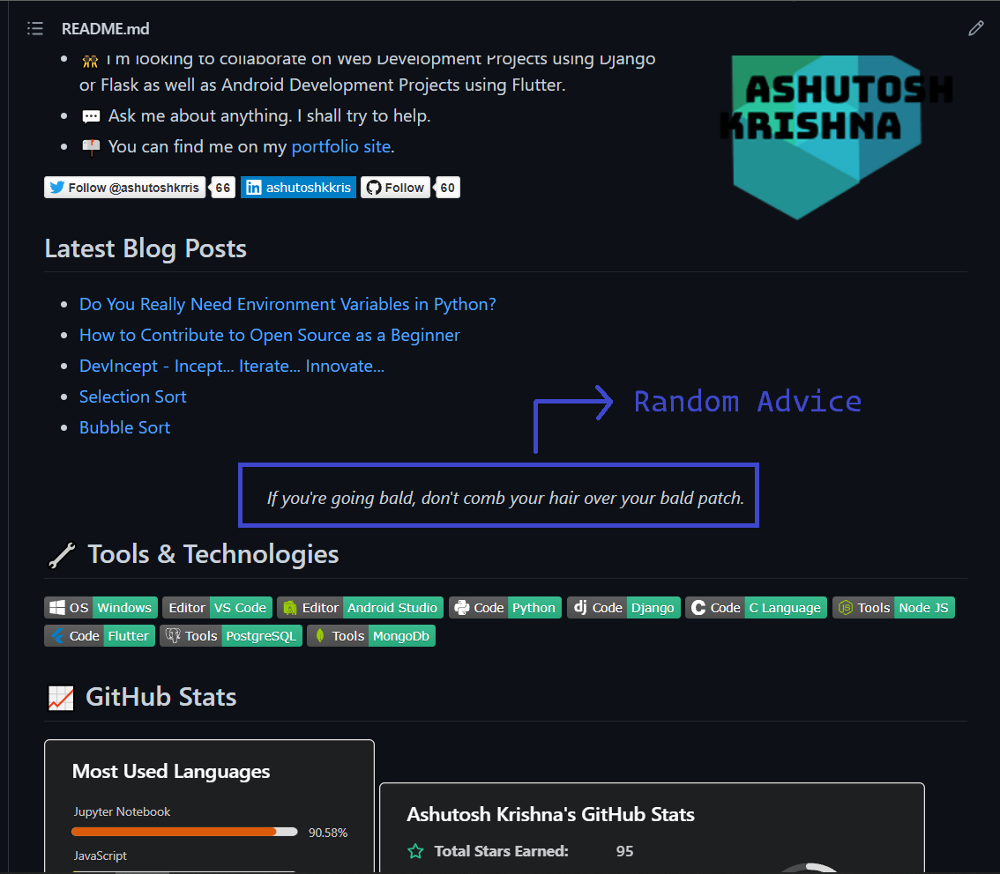

# Random Advice Workflow

<p align="center">
<a target="_blank" href="https://ashutoshkrris.com/" alt="Advice demo"></img></a>
</p>

## Advice sample
<!-- ADVICE:START -->
<p align="center"><br><i>Don't take life too seriously.</i><br></p>      
<!-- ADVICE:END -->

## How to use

1. Star this repo 😛
1. Go to your repository
1. Add the following section to your **README.md** file.<br>Just make sure that you use `<!-- ADVICE:START --><!-- ADVICE:END -->` in your readme.<br>The workflow will replace this comment with the amazing advice: 
    ```markdown
    <!-- ADVICE:START -->
    <!-- ADVICE:END -->
    ```
1. Create a folder named `.github` and create a `workflows` folder inside it, if it doesn't exist.
1. Create a new file named `random-advice-workflow.yml` with the following contents inside the workflows folder:
```yaml
name: Advice workflow
on:
  push:
  schedule: # Run workflow automatically
    - cron: '0 * * * *' # Runs every hour, on the hour

  # Allows you to run this workflow manually from the Actions tab
  workflow_dispatch:

# A workflow run is made up of one or more jobs that can run sequentially or in parallel
jobs:
  update-readme-with-quote:
    runs-on: ubuntu-latest

    steps:
      - uses: actions/checkout@v2
      - name: Setup node 14
        uses: actions/setup-node@v2
        with:
          node-version: 14.x
      - name: pull script to get quote
        uses: ashutoshkrris/random-advice-workflow@main
      - name: Commit and push changes
        run: |
          git config --global user.name "ashutoshkrris"
          git config --global user.email "contact@gmail.com"
          git add -A
          git commit -m "New Advice added"
          git push

```

1. Commit and wait for it to run automatically or you can also trigger it manually to see the result instantly. To trigger the workflow manually.

## Thanks to

- [Madhav Jha](https://github.com/jhamadhav/) for his brilliant `quote-workflow` that I have been using and which inspired me to make this `random-advice-workflow` of my own. I got to learn a lot of stuff from reading his code and README.


## Bugs

If you are experiencing any bugs, don’t forget to open a [new issue](https://github.com/ashutoshkrris/random-advice-workflow/issues/new).

## Liked it?

Hope you liked this project, don't forget to give it a star ⭐.